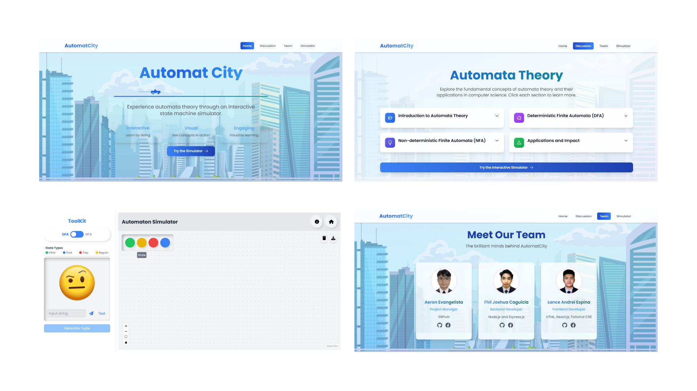
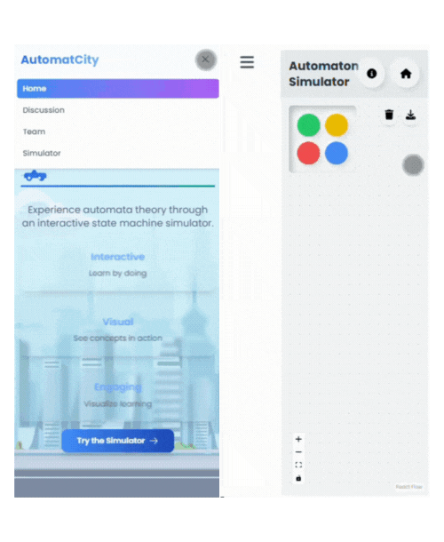
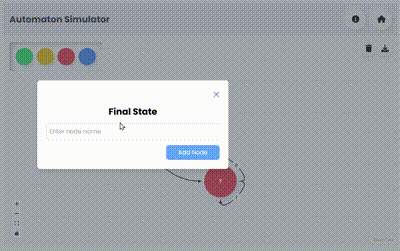
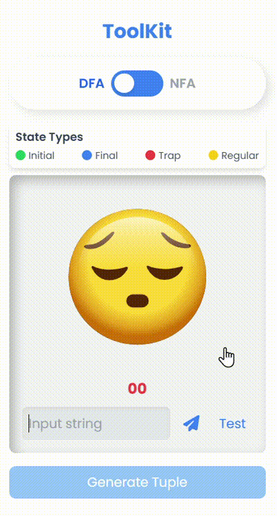
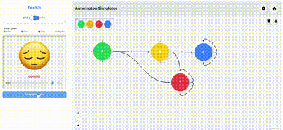

<div style="text-align: center; margin-bottom: 20px; 
            border: 2px solid #ccc; 
            padding: 15px; 
            border-radius: 15px; 
            box-shadow: 0px 4px 8px rgba(0, 0, 0, 0.1);">
  
</div>


<div align="center">
  <h1>Automat City: Interactive Automata Theory</h1>
  <p><em>*Where Theory Meets Interactive Practice in Automata Learning*</em></p>
</div>

---

<h2 style="background-color: rgba(0, 0, 0, 0.1); 
           padding: 15px; 
           border-radius: 10px; 
           box-shadow: 0px 4px 8px rgba(0, 0, 0, 0.2); 
           transition: transform 0.3s ease, box-shadow 0.3s ease;">
    📚 Table of Contents
</h2>

1. [Introduction](#introduction)
2. [Preview](#preview)
3. [Branches](#branches)
4. [Features](#features)  
   - [Discussion and Learning Modules](#discussion-and-learning-modules)  
   - [Automata Simulator](#automata-simulator)  
   - [User-Friendly Interface](#user-friendly-interface)  
5. [Technologies Used](#technologies-used)
6. [Installation and Setup](#installation)  
    - [Clone the Repository](#clone)
    - [Front End](#frontend1)
    - [Back End](#backend1)
7. [Developers](#developers)  
8. [Acknowledgments](#acknowledgments)  

---

<div id="introduction" style="text-align: justify;">
  <h2 style="background-color: rgba(0, 0, 0, 0.1); 
             padding: 15px; 
             border-radius: 10px; 
             box-shadow: 0px 4px 8px rgba(0, 0, 0, 0.2); 
             transition: transform 0.3s ease, box-shadow 0.3s ease;">
    🚀 Introduction
  </h2>
  <p><strong>  &nbsp;&nbsp;&nbsp;&nbsp;&nbsp;&nbsp; Automat City: Interactive Automata Theory</strong> is an interactive, web-based learning platform designed to enhance the understanding of Automata Theory. This platform focuses on core concepts such as state machines, Non-deterministic Finite Automata (NFAs), and Deterministic Finite Automata (DFAs). With built-in simulators, users can test and explore NFA and DFA cases, while also generating 5-tuples for better understanding of these computational models. The application aims to provide hands-on learning experiences, helping users to practice and apply their knowledge of computational theory through interactive simulations. Whether you are a student or enthusiast, AutoMat City offers a dynamic and engaging way to master Automata Theory.</p>
</div>


---
<h2 id="preview" style="background-color: rgba(0, 0, 0, 0.1); 
                           padding: 15px; 
                           border-radius: 10px; 
                           box-shadow: 0px 4px 8px rgba(0, 0, 0, 0.2); 
                           transition: transform 0.3s ease, box-shadow 0.3s ease;">
    💻 Preview
</h2>

### Desktop View
 

### Mobile View


---

<h2 id="branches" style="background-color: rgba(0, 0, 0, 0.1); 
                        padding: 15px; 
                        border-radius: 10px; 
                        box-shadow: 0px 4px 8px rgba(0, 0, 0, 0.2); 
                        transition: transform 0.3s ease, box-shadow 0.3s ease;">
    🌳 Branches
</h2>

<div style="padding: 0px;">
    <h3>🎨 Frontend</h3>
    <a href="https://github.com/LanceAndrei04/AutomatCity/tree/main" target="Main">
            main
    </a>

> This branch contains all the code related to the frontend of the project, including the user interface, styling, and client-side functionality. It uses React and Tailwind CSS to provide a dynamic and responsive design.

<h3>⚙️ Backend</h3>
    <a href="https://github.com/LanceAndrei04/AutomatCity/tree/backend" target="BackEnd">
        backend
    </a>

> Handles the server-side logic and database interactions, including API development and data processing to support frontend functionalities.
</div>

---

<h2 id="features" style="background-color: rgba(0, 0, 0, 0.1); 
                           padding: 15px; 
                           border-radius: 10px; 
                           box-shadow: 0px 4px 8px rgba(0, 0, 0, 0.2); 
                           transition: transform 0.3s ease, box-shadow 0.3s ease;">
    🛠️ Features
</h2>

<h3 id="discussion-and-learning-modules">1. Discussion and Learning Modules</h3>
<ul>
  <li>Comprehensive discussion covering **Introduction to Automata Theory**, **DFA (Deterministic Finite Automata)**, **NFA (Non-deterministic Finite Automata)**, and their **applications and impact**.</li>
  <li>This section serves as a guide for both beginners and advanced learners.</li>
</ul>

<h3 id="automata-simulator">2. Automata Simulator:</h3>
<ul>
  <li><strong>Input Nodes:</strong> Users can input various types of nodes, including:
    <ul>
      <li><strong>Initial Nodes</strong></li>
      <li><strong>Trap Nodes</strong></li>
      <li><strong>Regular Nodes</strong></li>
      <li><strong>Final State Nodes</strong></li>
    </ul>
            
  </li>
  <li><strong>Test Cases:</strong> Users can test input strings by entering them into the system. The simulator provides real-time results and visualizes the path of the computation. <br>
    
</li>
            
  <li><strong>Instant Input Validation:</strong> Check the correctness of input strings instantly to validate automata behavior.</li>
  <li><strong>Generate 5-Tuples:</strong> Automatically generates the formal **5-tuple** representation of the NFA or DFA based on the constructed automata.
              
  </li>
</ul>

<h3 id="user-friendly-interface">3. User-Friendly Interface:</h3>
<ul>
  <li><strong>Workspace:</strong> A dedicated workspace for creating and testing automata. Zoom in and out and freely place nodes anywhere for flexible automata creation.</li>
  <li><strong>Tutorial Button:</strong> Provides a tutorial to guide users through the process of using the platform effectively.</li>
  <li><strong>Screenshot Feature:</strong> Capture screenshots of the automata you've created to save, share, or document your work.</li>
</ul>

---

<h2 id="technologies-used" style="background-color: rgba(0, 0, 0, 0.1); 
                           padding: 15px; 
                           border-radius: 10px; 
                           box-shadow: 0px 4px 8px rgba(0, 0, 0, 0.2); 
                           transition: transform 0.3s ease, box-shadow 0.3s ease;">
    🖥️Technologies Used

### 🎨 Frontend
- **Languages:**
  - **HTML5**: Used for structuring web pages and content.
  - **CSS3**: Used for styling and layout of the web application.
  - **JavaScript**: Provides interactivity and logic for the frontend.

- **Frameworks/Libraries:**
  - **React**: A powerful JavaScript library for building user interfaces, allowing for a dynamic, component-based structure.
  - **Tailwind CSS**: A utility-first CSS framework for creating custom, responsive designs quickly and efficiently.
  - **Vite**: A modern build tool that offers fast, optimized development and build processes for the frontend application.


### ⚙️ Backend
- **Languages:**
  - **JavaScript**: Used throughout the backend for consistent code and full-stack JavaScript development.

- **Runtime Environment:**
  - **Node.js**: JavaScript runtime built on Chrome's V8 JavaScript engine, enabling backend development with JavaScript.

- **Framework:**
  - **Express**: A lightweight and flexible Node.js framework used to build APIs and manage server-side logic.

Here's an example of how to integrate with a React frontend:

```typescript
async function processAutomaton(): Promise<void> {
    // testCase: input string to process
    // currMode: 'DFA' or 'NFA'
    // nodes: array of automaton states
    // edges: array of transitions
    
    try {
        const response = await axios.get(
            `http://localhost:3000/automata/process_${currMode.toUpperCase()}`, 
            {
                params: {
                    nodes,
                    edges,
                    testCase: localData,
                }
            }
        );

        // Update state with automaton processing results
        setAutomatonResult({
            result: response.data.result,        // boolean: whether input is accepted
            statePath: response.data.statePath,  // array: path of states traversed
            isValid: response.data.isValid,      // boolean: whether automaton is valid
            acceptStates: response.data.acceptStates  // array: final/accepting states
        });

        // Response data includes:
        console.log("Input:", testCase);
        console.log("State Path:", response.data.statePath);
        console.log("Accepted:", response.data.result);
        console.log("Valid Automaton:", response.data.isValid);
        console.log(
            response.data.acceptStates?.length <= 0 
                ? "You did not specify any final states." 
                : "You have specified final states."
        );
    } catch (error) {
        console.error("Error processing automaton:", error);
    }
}
```

### API Response Format

The API returns a JSON object with the following structure:

```typescript
interface AutomatonResponse {
    result: boolean;      // Whether the input string is accepted
    statePath: string[];  // Sequence of states visited during processing
    isValid: boolean;     // Whether the automaton configuration is valid
    acceptStates: string[]; // List of accepting/final states
}
```
---
<h2 id="installation" style="background-color: rgba(0, 0, 0, 0.1); 
                             padding: 15px; 
                             border-radius: 10px; 
                             box-shadow: 0px 4px 8px rgba(0, 0, 0, 0.2); 
                             transition: transform 0.3s ease, box-shadow 0.3s ease;">
    ⚙️ Installation and Setup
</h2>

>### <a id="clone"></a> Clone the Repository
  &nbsp;&nbsp;&nbsp; You need to clone the repository where the frontend and backend are stored. Use the following command in your terminal or command prompt:
```powershell
  git clone https://github.com/LanceAndrei04/AutomatCity
```

>### <a id="frontend1"></a>Frontend
  &nbsp;&nbsp;&nbsp; First, install the dependencies for the frontend by running the following command in the terminal:

```powershell
  npm install
```
 &nbsp;&nbsp;&nbsp; To install the latest version of Vite, use this command:
 ```powershell
    npm install vite@latest
```
 &nbsp;&nbsp;&nbsp; To start the development server for the frontend, run the following command:
 ```powershell
    npm run dev
```

>### <a id="backend1"></a>Backend
&nbsp;&nbsp;&nbsp;First, install the dependencies for the backend by running the following command in the terminal:
 ```powershell
    npm install
```
&nbsp;&nbsp;&nbsp;To start the backend server, use the command below (<strong><em>Running the Server Locally</em></strong>):
 ```powershell
    npm run devStart
```

---
<h2 id="development" style="background-color: rgba(0, 0, 0, 0.1); 
                           padding: 15px; 
                           border-radius: 10px; 
                           box-shadow: 0px 4px 8px rgba(0, 0, 0, 0.2); 
                           transition: transform 0.3s ease, box-shadow 0.3s ease;">
    🔧 Development
</h2>
&nbsp;&nbsp;&nbsp;The server runs on port 3000 by default. Make sure no other service is using this port before starting the development server.

<h2 id="license" style="background-color: rgba(0, 0, 0, 0.1); 
                           padding: 15px; 
                           border-radius: 10px; 
                           box-shadow: 0px 4px 8px rgba(0, 0, 0, 0.2); 
                           transition: transform 0.3s ease, box-shadow 0.3s ease;">
    📄 License
</h2>
&nbsp;&nbsp;&nbsp;This project is licensed under the MIT License - see the LICENSE file for details.

<h2 id="developers" style="background-color: rgba(0, 0, 0, 0.1); 
                           padding: 15px; 
                           border-radius: 10px; 
                           box-shadow: 0px 4px 8px rgba(0, 0, 0, 0.2); 
                           transition: transform 0.3s ease, box-shadow 0.3s ease;">
    👥 Developers
</h2>

| **Name**                  | **Role**          | **GitHub**                                                       | **Other Contacts**                                                                 |
|---------------------------|-------------------|------------------------------------------------------------------|-----------------------------------------------------------------------------------|
| Espina, Lance Andrei R.| Frontend Developer | [LanceAndrei04](https://github.com/LanceAndrei04)                | [Lance Andrei](https://www.facebook.com/lance.espina.30) |
| Caguicla, Fhil Joshua P. | Backend Developer        | [HusPhil](https://github.com/HusPhil)                            | [Fhil Joshua Caguicla](https://www.facebook.com/kukuku.caguicla)                             |
| Evangelista, Aeron M.  | Project Manager           | [AeronEvangelista](https://github.com/AeronEvangelista)          | [Aeron Evangelista](https://www.facebook.com/mr.poginglamig)|


---


<div style="border: 2px solid #ccc; padding: 15px; border-radius: 10px; margin-bottom: 20px; margin-top: 20px;">
<h2 id="acknowledgments" style="text-align: center;margin-top: 0px;">🙏 Acknowledgments</h2>
  <p style="text-align: justify;">We would like to extend our gratitude to the following individuals for their invaluable support and guidance:</p>
  <ul style="text-align: justify;">
    <li><strong>Ms. Fatima Marie P. Agdon, MSCS</strong> – For providing us with the direction and insights necessary to complete this project. Her unwavering support, dedication, and expert guidance throughout the entire process played an essential role in the successful completion of this project. Her encouragement in tackling complex problems and her constructive feedback motivated us to push our boundaries and improve our skills. We greatly appreciate her commitment to our learning and development, and for helping us transform theoretical knowledge into practical application. The lessons and knowledge gained from her class will undoubtedly have a lasting impact on our future endeavors in web systems and technology.</li>
    <li><strong>Our Development Team</strong> – For their dedication, perseverance, and unwavering belief in their abilities. Their continuous efforts, innovative thinking, and teamwork were the driving forces behind this project’s success. We are proud of the progress and commitment shown by each member in overcoming challenges and delivering a high-quality learning platform.</li>
    <li><strong>Our Families and Friends</strong> – For their constant encouragement and support throughout the project.</li>
  </ul>
  <p style="text-align: justify;">We also acknowledge the open-source libraries and tools that made this project possible.</p>
</div>


---

<div style="text-align: center;">
    <strong><em>God bless us all!</em></strong>
</div>
